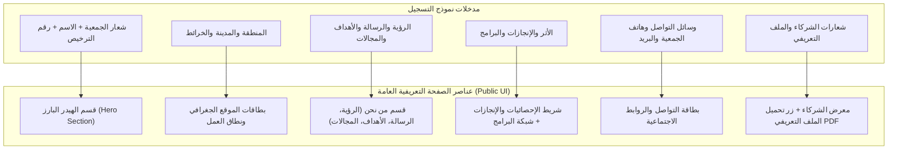

# دليل نماذج التسجيل وقواعد البيانات لمنصة خارطة الجمعيات الشبابية
> **دليل مخصص لفريق تصميم الواجهات (UI/UX Designers)**  
> **الهدف:** توضيح كافة نماذج التسجيل والمناطق والمدخلات والشروط وقواعد التحقق (Validation Rules) وقيم الخيارات المتاحة، وكيفية انعكاسها على **الصفحة التعريفية العامة للجهة (Organization Public Detail/Landing Page)**.

---

## فهرس المحتويات
1. [مقدمة وفكرة النظام](#1-مقدمة-وفكرة-النظام)
2. [نموذج تسجيل الجمعية والجهة الشبابية (Multi-Step Wizard)](#2-نموذج-تسجيل-الجمعية-والجهة-الشبابية)
   - [الخطوة الأولى: البيانات الأساسية والموقع](#الخطوة-الأولى-البيانات-الأساسية-والموقع)
   - [الخطوة الثانية: معلومات التواصل والقيادة](#الخطوة-الثانية-معلومات-التواصل-والقيادة)
   - [الخطوة الثالثة: عن الجمعية، البرامج، الإنجازات والشركاء](#الخطوة-الثالثة-عن-الجمعية-البرامج-الإنجازات-والشركاء)
   - [الخطوة الرابعة: المرفقات والشهادات والتعهد](#الخطوة-الرابعة-المرفقات-والشهادات-والتعهد)
3. [نموذج تسجيل الأندية الشبابية (Youth Clubs Form)](#3-نموذج-تسجيل-الأندية-الشبابية)
4. [نماذج الحسابات والهوية (Authentication Forms)](#4-نماذج-الحسابات-والهوية)
5. [دليل القوائم المنسدلة والخيارات المحددة (Dropdowns & Enums)](#5-دليل-القوائم-المنسدلة-والخيارات-المحددة)
6. [خريطة ربط نماذج التسجيل بالصفحة التعريفية العامة (Public Detail Page Mapping)](#6-خريطة-ربط-نماذج-التسجيل-بالصفحة-التعريفية-العامة)

---

## 1. مقدمة وفكرة النظام

تعتمد المنصة على تسجيل الجهات والجمعيات الشبابية عبر نموذج متعدد الخطوات (Multi-step Wizard) يتيح للجهة إدخال بياناتها التشغيلية، الجغرافية، القيادية، الإنجازات، المرفقات الرسمية، وشبكة وسائل التواصل الاجتماعي.

البيانات المدخلة في نماذج التسجيل تُستخدم مباشرة لبناء **الصفحة التعريفية العامة (Public Detail / Landing Page)** للجمعية، مما يتطلب تنسيق وتوزيع حقول المدخلات بما يتناسب مع المعايير التالية:
- وضوح الحقول الإجبارية (`*`) والحقول الاختيارية.
- قيود المدخلات (الحدود الدنيا والعليا للنصوص والأرقام والقوائم).
- أنواع المرفقات والأنماط المقبولة (PDF / PNG / JPG / SVG).
- حالات العرض الديناميكية (مثل: وجود مقر جغرافي أم جمعية افتراضية بدون مقر).

---

## 2. نموذج تسجيل الجمعية والجهة الشبابية

يتكون النموذج الرئيسي لتسجيل الجمعية (`OrgRegistrationForm`) من **4 خطوات متسلسلة**، مع حفظ آلي للمسودة (Draft) وقواعد تحقق صارمة على كل خطوة.

---

### الخطوة الأولى: البيانات الأساسية والموقع
*(Basic Data & Location)*

| اسم الحقل (عربي) | اسم الحقل بالرمز (Code Key) | نوع المدخل (Input Type) | حالة الحقل | شروط وقواعد التحقق (Validation Rules & Constraints) |
| :--- | :--- | :--- | :--- | :--- |
| **اسم الجمعية** | `step1.name` | نصي (Text) | **إجباري** | - 3 أحرف على الأقل. - يمثل الاسم المختصر للظهور الإعلامي بالمنصة. |
| **رقم الترخيص** | `step1.registrationNumber` | أرقام فقط (Numeric) | **إجباري** | - أرقام فقط (يمنع إدخال الحروف). - يجب ألا يكون فارغاً. |
| **سنة التأسيس** | `step1.foundingYear` | قائمة منسدلة (Select) | **إجباري** | - اختيار سنة من 1950 حتى السنة الحالية. |
| **تاريخ انتهاء الترخيص** | `step1.licenseExpiryDate` | منتقي تاريخ (DatePicker) | **إجباري** | - تاريخ بصلوحية YYYY-MM-DD. |
| **نسبة الحوكمة** | `step1.governancePercentage` | رقمي (%) | **إجباري** | - قيمة رقمية بين `0` و `100` (تظهر بعلامة %). |
| **نوع الجهة** | `step1.organizationType` | زر اختيار (Radio/Buttons) | **إجباري** | - القيمة الحالية: `youth` (جمعية شبابية). *(ملاحظة: "جهة شبابية" خيار مستقبلي).* |
| **تصنيف المركز الوطني المالي** | `step1.financialSizeClassification` | قائمة منسدلة مع بحث | **إجباري** | - اختيار من التصنيفات المالية الـ5 للمركز الوطني. |
| **التصنيف الفرعي / التخصص** | `step1.specialization` | قائمة منسدلة مع بحث | **إجباري** | - اختيار من التخصصات الفرعية المعرفّة في النظام. |
| **الفئة المستهدفة** | `step1.targetAudience` | أزرار تبديل (Buttons Group) | **إجباري** | - `male` (شباب) - `female` (فتيات) - `all` (شباب وفتيات) |
| **الحد الأدنى للعمر** | `step1.minAge` | رقمي (Number) | **إجباري** | - الحد الأدنى: `12` سنة. - الحد الأعلى: `34` سنة. - القيمة الافتراضية: `12`. |
| **الحد الأعلى للعمر** | `step1.maxAge` | رقمي (Number) | **إجباري** | - الحد الأدنى: `12` سنة. - الحد الأعلى: `34` سنة. - القيمة الافتراضية: `34`. - يشرط أن يكون `minAge <= maxAge`. |
| **عدد المستفيدين سنوياً** | `step1.annualBeneficiaries` | رقمي (Number) | **إجباري** | - رقم موجب يعبر عن عدد المستفيدين السنوي. |
| **وجود مقر للجمعية** | `step1.hasHeadquarters` | زر اختيار ثنائي (Toggle) | **إجباري** | - `true` (نعم، لدى الجمعية مقر) - `false` (لا، الجمعية افتراضية بدون مقر) |
| **المنطقة الجغرافية** | `step1.region` | قائمة منسدلة مع بحث | **إجباري** | - اختيار إحدى مناطق المملكة الـ 13. |
| **المدينة** | `step1.city` | قائمة منسدلة تابعة للمنطقة | **إجباري** | - تعتمد القائمة ديناميكياً على المنطقة المختارة. |
| **العنوان التفصيلي** | `step1.detailedAddress` | نصي (Text) | مشروط | - اسم الحي والشارع (يظهر عند اختيار وجود مقر). |
| **الموقع على الخارطة (الإحداثيات)** | `step1.latitude` & `step1.longitude` | خارطة تفاعلية (Map Picker) | **إجباري عند وجود مقر** | - يلزم تحديد النقطة جغرافيًا (Latitude / Longitude) بالضغط على الخارطة أو سحب الدبوس في حال `hasHeadquarters = true`. |
| **نطاق نشاط الجمعية** | `step1.activityRegions` | اختيار متعدد (Multi-Select) | **إجباري** | - اختيار منطقة واحدة على الأقل من مناطق المملكة الـ 13 التي يغطيها نشاط الجمعية. |

---

### الخطوة الثانية: معلومات التواصل والقيادة
*(Contact Info & Leadership)*

| اسم الحقل (عربي) | اسم الحقل بالرمز (Code Key) | نوع المدخل | حالة الحقل | شروط وقواعد التحقق |
| :--- | :--- | :--- | :--- | :--- |
| **رقم جوال الجمعية** | `step2.phone` | إدخال رقم جوال دولي | **إجباري** | - رقم جوال صحيح بلواحق الدولة (افتراضيًا SA +966) لا يقل عن 9 أرقام. |
| **البريد الإلكتروني للجمعية** | `step2.email` | بريد إلكتروني (Email) | **إجباري** | - صيغة بريد إلكتروني صحيحة (الاتجاه LTR). |
| **الموقع الإلكتروني** | `step2.website` | رابط (URL Input) | اختياري | - صيغة رابط صحيحة (تلقائياً يضاف `https://` عند كتابة الرابط بدونها). |
| **حسابات التواصل الاجتماعي** | `step2.socialMedia.*` | مجموعة مدخلات نصية (LTR) | اختياري | تشمل: `snapchat`, `twitter`, `instagram`, `linkedin`, `youtube`, `whatsapp`, `tiktok`. |
| **اسم المدير التنفيذي** | `step2.executiveDirectorName` | نصي (Text) | **إجباري** | - حرفان على الأقل. |
| **جوال المدير التنفيذي** | `step2.executiveDirectorPhone` | رقم جوال (PhoneInput) | **إجباري** | - رقم جوال صحيح. |
| **بريد المدير التنفيذي** | `step2.executiveDirectorEmail` | بريد إلكتروني | **إجباري** | - صيغة بريد إلكتروني صحيحة. |
| **اسم رئيس مجلس الإدارة** | `step2.boardChairmanName` | نصي (Text) | **إجباري** | - حرفان على الأقل. |
| **جوال رئيس مجلس الإدارة** | `step2.boardChairmanPhone` | رقم جوال (PhoneInput) | **إجباري** | - رقم جوال صحيح. |
| **بريد رئيس مجلس الإدارة** | `step2.boardChairmanEmail` | بريد إلكتروني | **إجباري** | - صيغة بريد إلكتروني صحيحة. |

---

### الخطوة الثالثة: عن الجمعية، البرامج، الإنجازات والشركاء
*(About, Vision, Mission, Goals, Fields, Achievements, Programs & Partners)*

| اسم الحقل (عربي) | اسم الحقل بالرمز (Code Key) | نوع المدخل | حالة الحقل | شروط وقواعد التحقق |
| :--- | :--- | :--- | :--- | :--- |
| **نبذة عن الجمعية** | `step3.about` | نص متعدد الأسطر (Textarea) | **إجباري** | - وصف تفصيلي لنشاط الجمعية وهدفها العام. |
| **الرؤية** | `step3.vision` | نص متعدد الأسطر | **إجباري** | - نص رؤية الجمعية المستقبلي. |
| **الرسالة** | `step3.mission` | نص متعدد الأسطر | **إجباري** | - نص رسالة الجمعية. |
| **الأهداف** | `step3.goals` | قائمة نصوص ديناميكية | **إجباري** | - **الحد الأدنى: 3 أهداف**. - **الحد الأعلى: 6 أهداف**. - لا يقبل نصوصاً فارغة. |
| **المجالات** | `step3.fields` | قائمة نصوص ديناميكية | **إجباري** | - **الحد الأدنى: 3 مجالات**. - **الحد الأعلى: 6 مجالات**. - لا يقبل نصوصاً فارغة. |
| **الأثر والإنجازات** | `step3.achievements` | قائمة عناصر متكررة | اختياري | يضم كل إنجاز: 1. **عنوان الإنجاز** (`title`): إجباري. 2. **حجم الإنجاز** (`size`): مثل (1000 مستفيد / 50 دورة). 3. **أيقونة الإنجاز** (`icon`): اختيار أيقونة معبرة من بين 16 أيقونة نظام محددة. |
| **البرامج والمشاريع** | `step3.programs` | قائمة عناصر متكررة | اختياري | يضم كل برنامج: 1. **عنوان البرنامج** (`name`): إجباري. 2. **نبذة عن البرنامج** (`description`): نص اختياري. 3. **عدد المستفيدين** (`beneficiariesCount`): رقمي اختياري. 4. **تصنيف البرنامج** (`type`): قائمة منسدلة باختيارات محددة. |
| **شعارات الشركاء** | `step3.partnerLogos` | رافع صور متعدد (MultiFile) | اختياري | - صور بدقة وجودة عالية. - الحد الأقصى لكل صورة `5MB`. |

---

### الخطوة الرابعة: المرفقات والشهادات والتعهد
*(Documents, Certificates & Terms)*

| اسم الحقل (عربي) | اسم الحقل بالرمز (Code Key) | نوع المدخل | حالة الحقل | شروط وقواعد التحقق |
| :--- | :--- | :--- | :--- | :--- |
| **شعار الجمعية (ملون)** | `step4.logoPath` | رافع صورة فردي (SingleFile) | **إجباري** | - صورة (Image) مقاس مأمول `500px × 500px`. - الحد الأقصى للحجم `5MB`. |
| **شهادة الترخيص الرسمية** | `step4.certificatePath` | رافع مستند فردي | **إجباري** | - ملف بصيغة `PDF` فقط. - الحد الأقصى للحجم `10MB`. |
| **الملف التعريفي للجمعية** | `step4.profileDocumentPath` | رافع مستند فردي | اختياري | - ملف بصيغة `PDF` فقط. - الحد الأقصى للحجم `10MB`. |
| **الموافقة على الشروط والأحكام** | `step4.termsAccepted` | مربع اختيار (Checkbox) | **إجباري** (في التسجيل الجديد) | - يجب التأشير بالموافقة لتقديم الطلب. |

---

## 3. نموذج تسجيل الأندية الشبابية
*(Youth Clubs Form Schema)*

يتيح هذا النموذج للجمعية أو المشرف إضافة ونشر نادي شبابي تتبع له.

| الحقل | الحقل بالرمز | نوع المدخل | الشروط وقواعد التحقق |
| :--- | :--- | :--- | :--- |
| **اسم النادي** | `name` | نصي | - 2 أحرف على الأقل (إجباري). |
| **الجنس المستهدف** | `gender` | قائمة منسدلة / أزرار | - `boys` (بنين)، `girls` (بنات)، `both` (الجنسين) (إجباري). |
| **الفئة العمرية (من - إلى)** | `minAge` & `maxAge` | أرقام صحيحة | - قيم أكبر من 0 (إجباري). - شرط: `minAge <= maxAge`. |
| **تاريخ البدء والانتهاء** | `startDate` & `endDate` | تاريخ (Date) | - شرط: `startDate <= endDate` (إجباري). |
| **رقم التواصل والبريد** | `phone` & `email` | جوال وبريد | - رقم جوال صحيح وبريد إلكتروني صالح (إجباري). |
| **العنوان التفصيلي والموقع** | `detailedAddress`, `region`, `city` | منسدلات ونصوص | - اختيار المنطقة والمدينة والعنوان التفصيلي (إجباري). |
| **الموقع على الخارطة** | `latitude` & `longitude` | إحداثيات الخارطة | - تحديد النقطة الجغرافية على الخريطة (إجباري). |
| **رابط التسجيل في النادي** | `registrationLink` | رابط خارجي (URL) | - صيغة رابط URL صحيح للتقديم بالنادي (إجباري). |

---

## 4. نماذج الحسابات والهوية
*(Authentication & Profile Schemas)*

| النموذج | الحقول | قواعد التحقق والقيود |
| :--- | :--- | :--- |
| **تسجيل الدخول (Login)** | `email`, `password` | - بريد صالح. - كلمة المرور 6 أحرف على الأقل. |
| **إنشاء حساب جديد (Register)** | `name`, `email`, `password`, `confirmPassword` | - الاسم حرفان على الأقل. - البريد صالح. - كلمة المرور 6 أحرف على الأقل. - مطابقة `password === confirmPassword`. |
| **التحقق برمز (OTP)** | `otp` | - 4 أرقام بالضبط (أرقام فقط). |
| **استعادة كلمة المرور** | `email` | - بريد إلكتروني صالح. |

---

## 5. دليل القوائم المنسدلة والخيارات المحددة (Enums & Options)

لكي يتمكن مصمم الواجهات من رسم مكونات الاختيارات (Dropdowns / Badges / Selects) بدقة، فيما يلي القوائم الثابتة المعتمدة في النظام:

### أ) تصنيف المركز الوطني للجمعيات (حسب الحجم المالي)
1. `متناهية الصغر (أقل من 500 ألف)`
2. `الصغيرة (501 ألف - 2 مليون)`
3. `المتوسطة (2 مليون - 8 مليون)`
4. `الكبيرة (8 مليون - 30 مليون)`
5. `متناهية الكبر (30 مليون فأكثر)`

### ب) التخصص / التصنيف الفرعي للجمعيات
1. `خدمات الإرشاد والتوجيه المهني`
2. `تعزيز الاعتماد على الذات`
3. `خدمات الشباب والنشئ`

### ج) تصنيفات البرامج والمشاريع (`PROGRAM_TYPES`)
- `برنامج تدريبي`
- `برنامج تطوعي`
- `برنامج توعوي`
- `برنامج اجتماعي`
- `برنامج مهاري`
- `برنامج رياضي`
- `برنامج قيمي`
- `برنامج ترفيهي`

### د) قائمة الأيقونات المتاحة للإنجازات (`ACHIEVEMENT_ICONS`)
يحتوي النظام على 16 أيقونة اختيارية للإنجازات:
1. `community` (المجتمع)
2. `growth` (النمو)
3. `finance` (المالية)
4. `achievement` (الإنجاز)
5. `global` (عالمي)
6. `education` (التعليم)
7. `partnership` (الشراكة)
8. `announcement` (الإعلان)
9. `analytics` (التحليلات)
10. `technology` (التقنية)
11. `care` (الرعاية)
12. `environment` (البيئة)
13. `knowledge` (المعرفة)
14. `events` (الفعاليات)
15. `awards` (الجوائز)
16. `business` (الأعمال)

### هـ) المناطق الجغرافية الـ 13 بالمملكة والمدن الرئيسية
- **الرياض:** (الرياض، الدرعية، الخرج، المجمعة، الزلفي، شقراء، ...)
- **مكة المكرمة:** (مكة المكرمة، جدة، الطائف، القنفذة، رابغ، ...)
- **المدينة المنورة:** (المدينة المنورة، ينبع، العلا، بدر، ...)
- **القصيم:** (بريدة، عنيزة، الرس، البكيرية، ...)
- **الشرقية:** (الدمام، الخبر، الظهران، الأحساء، القطيف، الجبيل، حفر الباطن، ...)
- **عسير:** (أبها، خميس مشيط، بيشة، النماص، محايل عسير، ...)
- **تبوك:** (تبوك، الوجه، ضباء، أملج، ...)
- **حائل:** (حائل، بقعاء، ...)
- **الحدود الشمالية:** (عرعر، رفحاء، طريف، ...)
- **جازان:** (جازان، صبيا، أبو عريش، صامطة، بيش، ...)
- **نجران:** (نجران، شرورة، ...)
- **الباحة:** (الباحة، بلجرشي، المخواة، ...)
- **الجوف:** (سكاكا، القريات، دومة الجندل، طبرجل)

---

## 6. خريطة ربط نماذج التسجيل بالصفحة التعريفية العامة
*(Public Organization Detail Page Mapping)*

يساعد هذا الجدول مصمم الـ UI على تخيل وتوزيع مكونات **الصفحة التعريفية للجمعية (Public Landing / Detail Page)** بناءً على المدخلات القادمة من نماذج التسجيل:

### تفاصيل توزيع عناصر الصفحة التعريفية (UI Wireframe Blueprint):

1. **الترويسة الرئيسية (Hero Header Section):**
   - **شعار الجمعية الملون** (`step4.logoPath`).
   - **اسم الجمعية** (`step1.name`).
   - **شارات البيانات (Badges):** رقم الترخيص (`step1.registrationNumber`)، نوع الجمعية، شارة نسبة الحوكمة (`step1.governancePercentage%`)، وسنة التأسيس (`step1.foundingYear`).
   - **زر إجراء (CTA):** زر للتحميل المباشر للملف التعريفي (`step4.profileDocumentPath`) أو الشهادة الرسمية.

2. **قسم التعريف والمعلومات الأساسية (About & Identity Section):**
   - **بطاقة نبذة الجمعية** (`step3.about`).
   - **بطاقتان متجاورتان للرؤية والرسالة** (`step3.vision` & `step3.mission`).
   - **شبكة الأهداف الاستراتيجية** (من 3 إلى 6 بطاقات/نقاط) (`step3.goals`).
   - **شبكة مجالات العمل** (من 3 إلى 6 مجالات) (`step3.fields`).

3. **شريط الأثر والإنجازات (Impact & Achievements Grid):**
   - عرض الإنجازات المدخلة (`step3.achievements`) كبطاقات إحصائية تضم: الأيقونة المحددة، عنوان الإنجاز، وحجم الإنجاز (مثال: "5,000+ متطوع").

4. **قسم البرامج والمشاريع (Programs & Projects Gallery):**
   - بطاقات تفاعلية تعبر عن كل برنامج (`step3.programs`) تشمل: عنوان البرنامج، التصنيف (Badge مثل: "برنامج تدريبي")، نبذة البرنامج، وعدد المستفيدين.

5. **الموقع والنطاق الجغرافي (Location & Geographical Reach):**
   - في حال وجود مقر: خريطة تفاعلية مثبت بها دبوس موقع الجمعية (`latitude`, `longitude`) + العنوان التفصيلي (`step1.detailedAddress`) + المدينة والمنطقة.
   - قسم شارات المناطق: المناطق التابعة لنطاق عمل الجمعية (`step1.activityRegions`).

6. **قسم الشركاء والداعمين (Partners Section):**
   - شريط أو شبكة تضم **شعارات الشركاء** (`step3.partnerLogos`).

7. **بطاقة التواصل والدعم (Contact & Social Footer/Sidebar):**
   - رقم الجوال العام، البريد الإلكتروني، والموقع الإلكتروني.
   - أيقونات تفاعلية لجميع شبكات التواصل الاجتماعي المتاحة (Snapchat, X/Twitter, Instagram, LinkedIn, YouTube, WhatsApp, TikTok).
